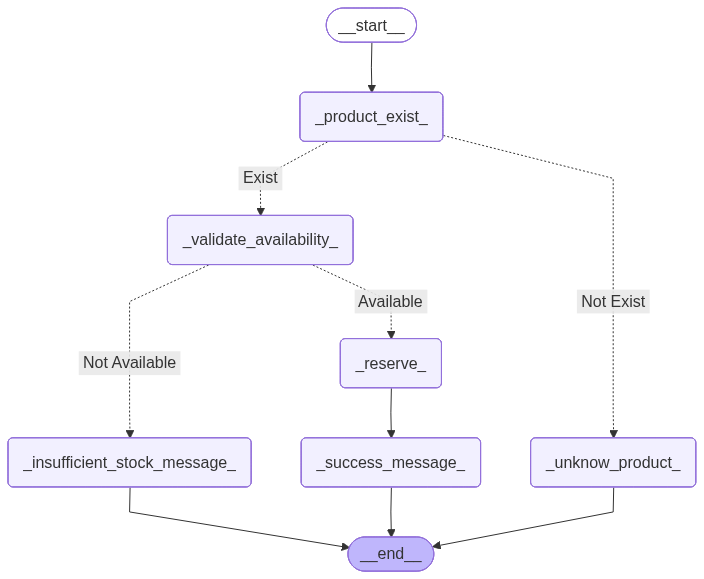

# 🦜 LangGraph Experiments & Tutorials

Welcome to this repository. This is a collection of Jupyter Notebooks and Python scripts dedicated to learning and mastering LangGraph.

The goal of this project is to document the progression from building simple stateful graphs to creating complex, autonomous AI agents. It serves as both a personal knowledge base and a practical guide for understanding how to build reliable AI workflows.

### Repository Structure
The notebooks are organized by complexity level, covering specific concepts of the LangGraph library.

**1. Foundations**
* Basic concepts of nodes, edges, and state management.
* Basic Chat: Setting up a simple StateGraph with a Human and AI loop.
* State Management: Understanding TypedDict, schema definitions, and how data flows between nodes.
* Handling History: Implementing manual history management (list of lists) for chat interfaces like Gradio.

**2. Logic & Control Flow**
* Introducing conditional logic and dynamic behavior.
* Conditional Edges: Routing the conversation flow based on user input or LLM decisions.
* Dynamic System Prompts: (Example: The Industrial Consultant) A notebook demonstrating how to inject specific personas (e.g., Lean Expert vs. Supply Chain Expert) into the graph state at runtime without rebuilding the graph.

**3. Advanced Concepts (In Progress)**
Future notebooks will cover:
* Persistence: Using Checkpointers to save conversation memory across sessions.
* Tool Calling: Giving the graph the ability to use external tools (search, calculators, APIs).
* Human-in-the-loop: Interrupting graph execution for user approval.
* Multi-Agent Systems: Orchestrating multiple specialized agents working together.

### Technologies
* LangGraph 🦜
* LangChain
* OpenAI GPT-4o
* Gradio (for user interfaces)
