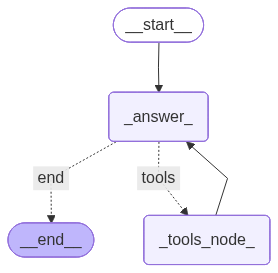

# 🦜 LangGraph Experiments

This repository serves as a comprehensive guide and knowledge base for building stateful AI agents using LangGraph. It documents a progressive learning path, moving from fundamental graph concepts to the deployment of autonomous agents capable of Retrieval-Augmented Generation (RAG).

<p align="center">
  
</p>

## Project Overview

The goal of this project is to demonstrate how to orchestrate Large Language Models (LLMs) using graph-based workflows. Unlike linear chains, these graphs allow for cycles, persistence, and complex decision-making processes essential for building reliable AI applications.

## Repository Contents

The notebooks are numbered sequentially to represent increasing complexity.

### I. Foundations & Control Flow
* **01_BasicLangGraph.ipynb**
  Introduction to the core components: Nodes, Edges, and the `StateGraph` compilation process.
* **02_LangGraph_Conditional_Nodes.ipynb**
  Implementation of non-linear workflows. Demonstrates how to use conditional edges to route execution based on dynamic logic.
* **03_Basic_Chat_Conversation_No_Memory.ipynb**
  Setup of a minimal feedback loop between a Human and an AI node, establishing the basic architecture for chat interfaces.

### II. State Management & Behavior
* **04_LangGraph_SystemMessage.ipynb**
  Techniques for injecting system prompts to control agent persona and behavior contextually within the graph state.
* **05_Basic_Chat_with_Memory_&_Reducer.ipynb**
  Deep dive into persistence. Covers `MemorySaver`, checkpointers, and the logic of "Reducers" (e.g., `add_messages`) to manage conversation history effectively across turns.
* **06_Expert_Specific_Memory_and_Guardrails.ipynb**
  Advanced state management. Focuses on structuring the state for specific expert tasks and implementing guardrails to ensure output validity and safety.

### III. Autonomous Agents
* **07_LangGraph_Agent_RAG.ipynb**
  A production-ready implementation of a ReAct agent.
  * **Tool Use:** Integration with the Tavily API for real-time web search.
  * **Reasoning:** The agent dynamically decides when to query external tools vs. answering from internal knowledge.
  * **Architecture:** Combines memory, tool nodes, and conditional routing into a cohesive system.
 
<p align="center">
  
</p>

## technical Stack

* **LangGraph:** Orchestration and state management.
* **LangChain:** Model interfacing and tool definitions.
* **OpenAI (GPT-4o):** The reasoning engine.
* **Tavily API:** Search and information retrieval.
* **Vector Store:** ChromaDB 
* **Embeddings:** OpenAI text-embedding-3-large
* **Document Processing:** PyPDFLoader & RecursiveCharacterTextSplitter

## Setup & Usage

1. **Clone the repository:**
   ```bash
   git clone [https://github.com/Nathdo/LangGraph.git](https://github.com/Nathdo/LangGraph.git)
