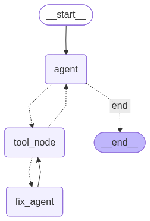
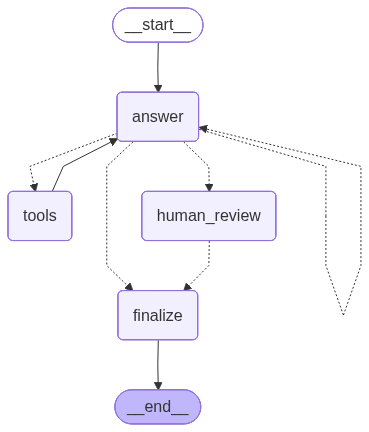

# 🦜 LangGraph Experiments

This repository serves as a comprehensive guide and knowledge base for building stateful AI agents using LangGraph. It documents a progressive learning path, moving from fundamental graph concepts to the deployment of autonomous agents capable of Retrieval-Augmented Generation (RAG).

<p align="center">
  
</p>

## Project Overview

The goal of this project is to demonstrate how to orchestrate Large Language Models (LLMs) using graph-based workflows. Unlike linear chains, these graphs allow for cycles, persistence, and complex decision-making processes essential for building reliable AI applications.

<p align="center">
  
</p>

## Repository Contents

The notebooks are numbered sequentially to represent increasing complexity.

### I. Foundations & Control Flow
* **01_BasicLangGraph.ipynb**
  Introduction to the core components: Nodes, Edges, and the `StateGraph` compilation process.
* **02_LangGraph_Conditional_Nodes.ipynb**
  Implementation of non-linear workflows. Demonstrates how to use conditional edges to route execution based on dynamic logic.
* **03_Basic_Chat_Conversation_No_Memory.ipynb**
  Setup of a minimal feedback loop between a Human and an AI node, establishing the basic architecture for chat interfaces.

### II. State Management & Behavior
* **04_LangGraph_SystemMessage.ipynb**
  Techniques for injecting system prompts to control agent persona and behavior contextually within the graph state.
* **05_Basic_Chat_with_Memory_&_Reducer.ipynb**
  Deep dive into persistence. Covers `MemorySaver`, checkpointers, and the logic of "Reducers" (e.g., `add_messages`) to manage conversation history effectively across turns.
* **06_Expert_Specific_Memory_and_Guardrails.ipynb**
  Advanced state management. Focuses on structuring the state for specific expert tasks and implementing guardrails to ensure output validity and safety.

### III. Autonomous Agents
* **07_LangGraph_Agent_RAG.ipynb**
  A production-ready implementation of a ReAct agent.
  * **Tool Use:** Integration with the Tavily API for real-time web search.
  * **Reasoning:** The agent dynamically decides when to query external tools vs. answering from internal knowledge.
  * **Architecture:** Combines memory, tool nodes, and conditional routing into a cohesive system.
* **08_Retrieval_Augmented_Generation.ipynb**
  * Implementation of a classic RAG pipeline for document analysis.
  * Pipeline: Document ingestion (PDF), splitting, embedding, and vector storage.
  * Retrieval: Semantic search logic integrated directly into the graph flow.
 
<p align="center">
  
</p>


### IV. Specialized Integrations

* **09_LangGraph_SQL_Agent.ipynb**
  * A specialized agent designed to interact with structured databases.
  * Capabilities: Dynamic schema introspection, SQL query generation, and safe execution.
  * Goal: Chat with your data using natural language.

* **10_MCP_&_LangGraph.ipynb**
  * Integration of the Model Context Protocol (MCP).
  * Concept: Decoupling tool implementation from the agent logic.
  * Architecture: Using MultiServerMCPClient to connect to remote tool servers (e.g., GlobalPing) via standard protocols (SSE/HTTP), utilizing asynchronous execution (asyncio) for performance.

* **example_10_HITL_v2.ipynb**
  * An interactive agent implementing a **Human-in-the-Loop (HITL)** workflow using LangGraph.
  * **Capabilities:** Conditional interruption based on confidence scores, manual review/correction of AI answers, and conversation switching (Thread ID management) to isolate memory contexts.
  * **Goal:** Enhance reliability by seamlessly integrating human oversight into the automated reasoning loop.

<p align="center">
  
</p>

## technical Stack

* **LangGraph:** Orchestration and state management.
* **LangChain:** Model interfacing and tool definitions.
* **OpenAI (GPT-4o):** The reasoning engine.
* **Tavily API:** Search and information retrieval.
* **Vector Store:** ChromaDB 
* **Embeddings:** OpenAI text-embedding-3-large
* **Document Processing:** PyPDFLoader & RecursiveCharacterTextSplitter
* **GlobalPing API:** Network diagnostics and measurements.
* **Model Context Protocol (MCP):** Standardized interface for external tools.

## Setup & Usage

1. **Clone the repository:**
   ```bash
   git clone [https://github.com/Nathdo/LangGraph.git](https://github.com/Nathdo/LangGraph.git)
